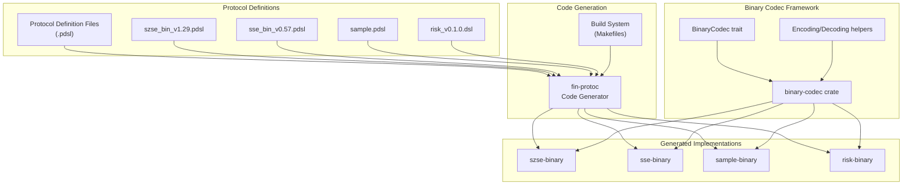
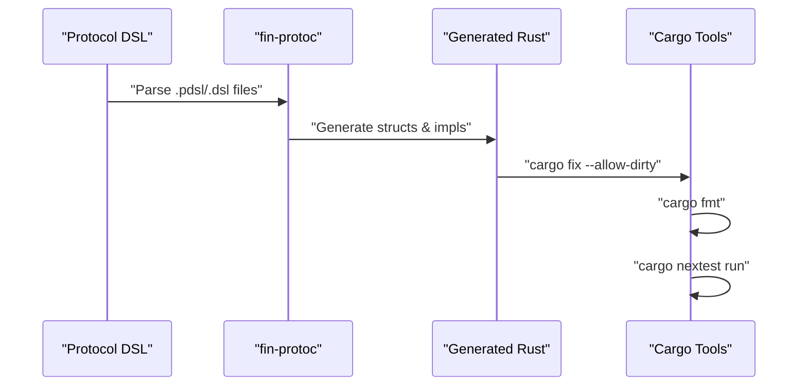
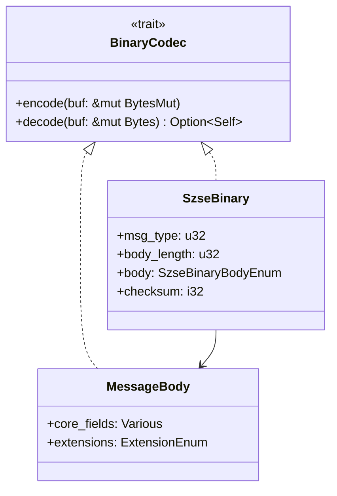

# fin-proto-rs

A Rust-based financial protocol code generation and binary codec framework for high-performance trading systems.

## Overview

This repository provides a comprehensive system for generating Rust code from financial protocol definitions and implementing efficient binary serialization/deserialization for trading messages. [1](#0-0) The system supports multiple exchange protocols including SZSE (Shenzhen Stock Exchange), SSE (Shanghai Stock Exchange), and sample implementations. [2](#0-1)

## Architecture

## Core Components

### Binary Codec Framework

The foundation of the system is the `BinaryCodec` trait that provides efficient binary serialization: [3](#0-2)

Key features:

- Zero-copy deserialization using `Bytes`
- Efficient encoding to `BytesMut` buffers
- Support for complex data structures and lists [4](#0-3)

### Code Generation System

The `fin-protoc` tool transforms protocol definitions into Rust implementations: [5](#0-4)

## Exchange Implementations

### SZSE Binary Protocol

Implements Shenzhen Stock Exchange binary messaging with sophisticated message routing: [6](#0-5)

Key message types:

- Session management (Logon, Logout, Heartbeat)
- Trading messages (NewOrder, ExecutionConfirm, ExecutionReport)
- System messages (BusinessReject, ReportSynchronization)

### SSE Binary Protocol

Shanghai Stock Exchange implementation with similar structure: [7](#0-6)

### Sample Implementation

Provides examples and testing infrastructure: [8](#0-7)

## Message Structure

All generated messages follow a consistent pattern:

## Build System

Each implementation uses standardized Makefiles with common targets: [9](#0-8)

- `make compile`: Generate code from protocol definitions
- `make fmt`: Format generated code
- `make fix`: Apply automatic fixes
- `make test`: Run comprehensive tests

## Getting Started

1. **Prerequisites**: Install `fin-protoc` binary in `~/workspace/fin-protoc/bin/`
2. **Build**: Run `make all` in any implementation directory
3. **Test**: Generated code includes comprehensive unit tests [10](#0-9)

## Protocol Extensions

The system supports ApplID-based extensions for market-specific functionality: [11](#0-10)

This allows the same message type to have different field structures based on market segment requirements while maintaining protocol consistency.

## Related Repositories

- [`fin-proto`](https://github.com/xinchentechnote/fin-proto)

  - A comprehensive financial protocol library
  - Supports SSE, SZSE, and risk protocols
  - Includes Lua dissectors for Wireshark

- [`fin-proto-go`](https://github.com/xinchentechnote/fin-proto-go)

  - Native Go implementation of the protocols
  - Standardized codec interface
  - Modular, exchange-specific architecture
  - This repository has been integrated into the [`gt-auto`](https://github.com/xinchentechnote/gt-auto) repository, an automated testing tool for financial systems(gateway,engine and so on)

- [`fin-proto-cpp`](https://github.com/xinchentechnote/fin-proto-cpp)

  - Efficient C++ implementation
  - Protocol support for SSE, SZSE, risk
  - Optimized serialization logic

- [`fin-proto-java`](https://github.com/xinchentechnote/fin-proto-java)

  - Binary protocol codec for Java
  - Netty ByteBuf integration
  - Gradle build system
  - Java 17+ compatible

- [`fin-proto-py`](https://github.com/xinchentechnote/fin-proto-py)

  - Python implementation for financial protocols
  - SSE, SZSE, and risk protocol support
  - Easy-to-use parsing and serialization API

